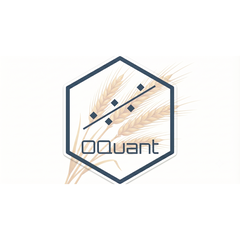

```{=html}
<div class="rh-hero">
  <div class="rh-hero-photo">
    
  </div>
  <div class="rh-hero-main">
    <div class="rh-kicker">Econometrista · A ciência de dados original</div>
    <h1>Rodrigo <span class="rh-grad">Hermont Ozon</span></h1>
    <p class="rh-hero-tagline">
      Cientista de Dados na <strong>Unimed do Estado do Paraná</strong>, pesquisador de doutorado em Engenharia de
      Produção e Sistemas (PUCPR), fundador da consultoria <strong>OQuant</strong> e ex-professor da FAE Business School (2025–2026).
      Quinze anos aplicando modelos da família GARCH, econometria bayesiana, otimização multiobjetivo
      e, mais recentemente, sistemas de IA multiagente a problemas de saúde, agronegócio e indústria.
    </p>
    <div style="margin-top: 1.2rem;">
      <a class="rh-btn rh-btn-primary" href="oquant.html">Consultoria</a>
      <a class="rh-btn rh-btn-ghost" href="../cv.html">CV completo</a>
      <a class="rh-btn rh-btn-ghost" href="https://wa.me/5541988382904">WhatsApp</a>
    </div>
  </div>
</div>

<div class="rh-stats">
  <div class="rh-stat"><span class="num" data-target="15">15+</span><span class="lbl">Anos em dados</span></div>
  <div class="rh-stat"><span class="num" data-target="20">20+</span><span class="lbl">Organizações atendidas</span></div>
  <div class="rh-stat"><span class="num" data-target="15">15+</span><span class="lbl">Artigos & palestras</span></div>
  <div class="rh-stat"><span class="num" data-target="6">6</span><span class="lbl">Instituições onde lecionei</span></div>
</div>
```

::: {.rh-section}
<div class="rh-kicker">O que eu faço</div>
## Quatro frentes, uma disciplina

```{=html}
<div style="display:grid; grid-template-columns:repeat(auto-fit,minmax(260px,1fr)); gap:1.1rem; margin-top:1.4rem;">
  <div class="rh-card">
    <h3>Econometria &amp; Forecasting</h3>
    <p>Séries temporais, métodos bayesianos, modelos de volatilidade da família GARCH, inferência causal e
    otimização multiobjetivo de portfólios — aplicados a commodities, saúde e indústria.</p>
  </div>
  <div class="rh-card">
    <h3>Ciência de Dados &amp; IA</h3>
    <p>Machine learning, MLOps e IA Generativa: chatbots internos, orquestração multiagente
    e tomada de decisão assistida por IA em ambientes de produção.</p>
  </div>
  <div class="rh-card">
    <h3>Consultoria (OQuant)</h3>
    <p>Fundador &amp; consultor principal. Projetos para Grupo Fleury, Aurora Alimentos e Cogna
    Educacional em forecasting, análise de risco e suporte à decisão.</p>
  </div>
  <div class="rh-card">
    <h3>Docência &amp; Pesquisa</h3>
    <p>Lecionei Data Science for Business e Mercados Financeiros na FAE (2025–2026). Pesquisador de doutorado na
    PUCPR. Revisor da <em>Applied Soft Computing</em> e da <em>PRINCIPIA</em>.</p>
  </div>
</div>
```
:::

::: {.rh-section}
<div class="rh-kicker">Trajetória</div>
## Onde gerei impacto

```{=html}
<div class="rh-logos">
  <a href="experience.html" title="Unimed do Estado do Paraná"></a>
  <a href="oquant.html" title="OQuant Data Science Consulting"></a>
  <a href="experience.html" title="Volvo Group"></a>
  <a href="experience.html" title="CNH Industrial"></a>
  <a href="experience.html" title="BRF"></a>
  <a href="experience.html" title="PNUD / ONU"></a>
  <a href="teaching.html" title="FAE Business School"></a>
  <a href="research.html" title="PUCPR"></a>
</div>
<p><a class="rh-btn rh-btn-ghost" href="experience.html">Ver experiência completa </a></p>
```
:::

::: {.rh-section}
<div class="rh-kicker">Destaques recentes</div>
## Trabalhos recentes & reconhecimento

```{=html}
<div class="rh-pub"><strong>2026 —</strong> Cientista de Dados na Unimed do Estado do Paraná: analytics em saúde e IA Generativa (chatbots, orquestração multiagente). <span class="rh-pub-venue">Curitiba, PR</span></div>
<div class="rh-pub"><strong>2024 —</strong> <em>Comparative Analysis of Fuzzy Regression Models and Multicriteria Decision-Making for Commodity Market Forecasting Scenarios.</em> <span class="rh-pub-venue">LVI SBPO, Fortaleza</span></div>
<div class="rh-pub"><strong>2024 —</strong> <em>Predictive Maintenance Strategies in Agriculture Using Survival Analysis.</em> <span class="rh-pub-venue">XXV Congresso Brasileiro de Automática</span></div>
<div class="rh-pub"><strong>2024 —</strong> Finalista de Doutorado. <span class="rh-pub-venue">XI ENPPEPRO — Encontro Nacional dos Programas de Pós-Graduação em Engenharia de Produção</span></div>
<p style="margin-top:1rem;"><a class="rh-btn rh-btn-ghost" href="research.html">Toda a pesquisa </a></p>
```
:::
